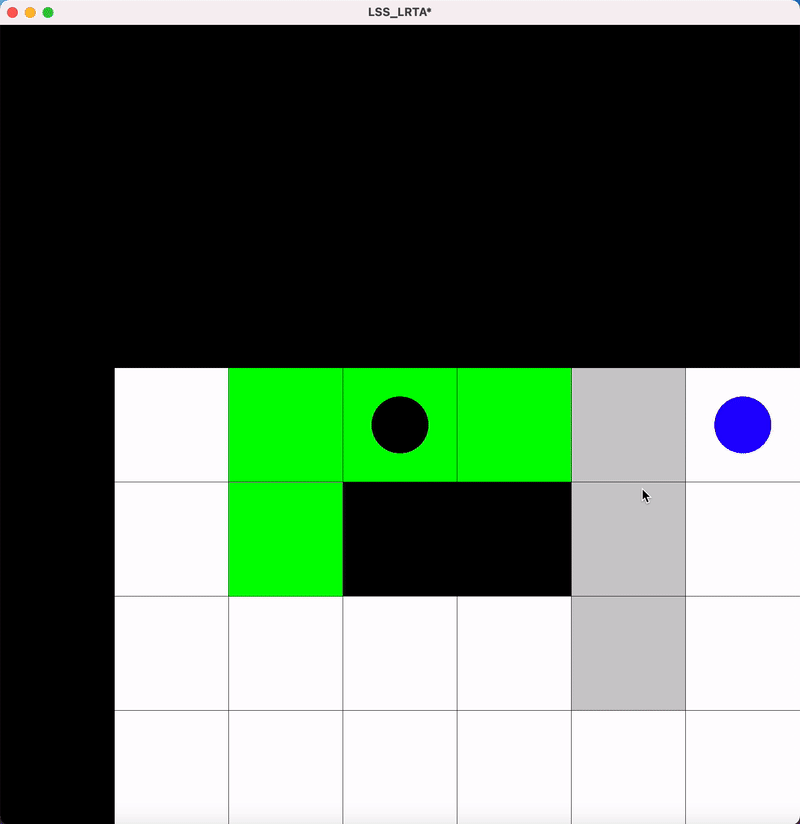

# PathPlanning
This project observes and implements limited visibility pathfinding algorithm called LSS-LRTA<sup>*</sup>.

It interleaves А<sup>*</sup> path finding with heuristics updates and action executions.



Center black circle - agent

Blue circle - finish cell

Green area - visibility area

White cell - empty cell

Grey cell - cell with an obstacle, that was not yet discovered by the agent

Black cell - cell with an obstacle, that was discovered by the agent

Black line - path found by A<sup>*</sup>

More about the algorithm: https://link.springer.com/article/10.1007/s10458-008-9061-x

## Launch instuctions
Launch scripts are placed in the `Scripts` folder.
From `Scripts` you can build Release-version of the project running this command:
```bash
./BuildRelease
```
And Debug-version like this:
```bash
./BuildDebug
```
To run on a test 'YourTest.xml' do this:
```cmd
./Run{Release|Debug} YourTest.xml
```

## Input format
XML file.
* Map description
  * width, height - map size
  * cellsize - size of a single map cell
  * startx, starty - start coordinates
  * finishx, finishy - finish coordinates
  * grid - map in the form of matrix consisting of 0 and 1, where 0 means an empty cell and 1 means an obstacle.   
* Search type description
  * metrictype - type of a metric used to calculate distances.
    * diagonal  

    * manhatten
    
    * euclidian

    * chebyshev
  * allowdiagonal - if true, agent can move diagonally
  * cutcorners - if true, agent can cut corners of obstacles
  * allowsqueeze - if true, agent can squeeze through two obstacles sharing only one cell corner
  * visibility - distance in cells, tha can be observed by the agent vertically and horizontally.
  * lookahead - A<sup>*</sup> state expansion limit 
  
## Output format
* numberofsteps - number of steps performed by the algorithm
* nodescreated - number of Node-type ojects created
* length - length of the path found
* length_scaled - length of the path found considering cell sizes
* time - run time of the algorithm
* path - image of the path on the map
* lplevel - cell sequence, that form the path
* hplevel - sequence of one-directional segments of the path.


During the run time of the algorithm an "YourFile_vlog.txt" file is also created. It serves for visualization.

## Visualization

To run visualization, go to `Visualization/Visualization` folder and run the code, passing file of the form "YourFile_vlog.txt" as command line argument.

To make visualization work, you need to have an SFML library installed(https://www.sfml-dev.org/).
